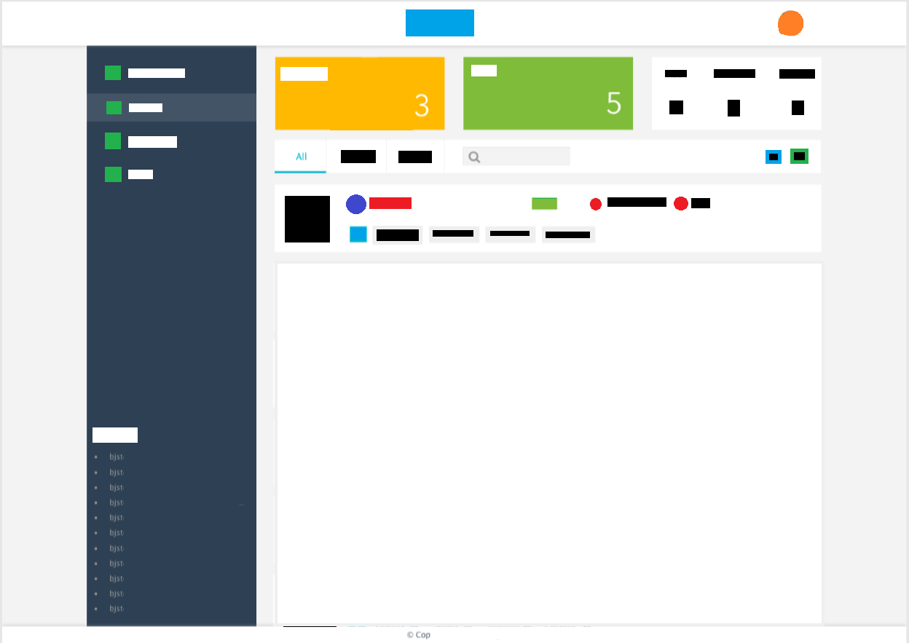
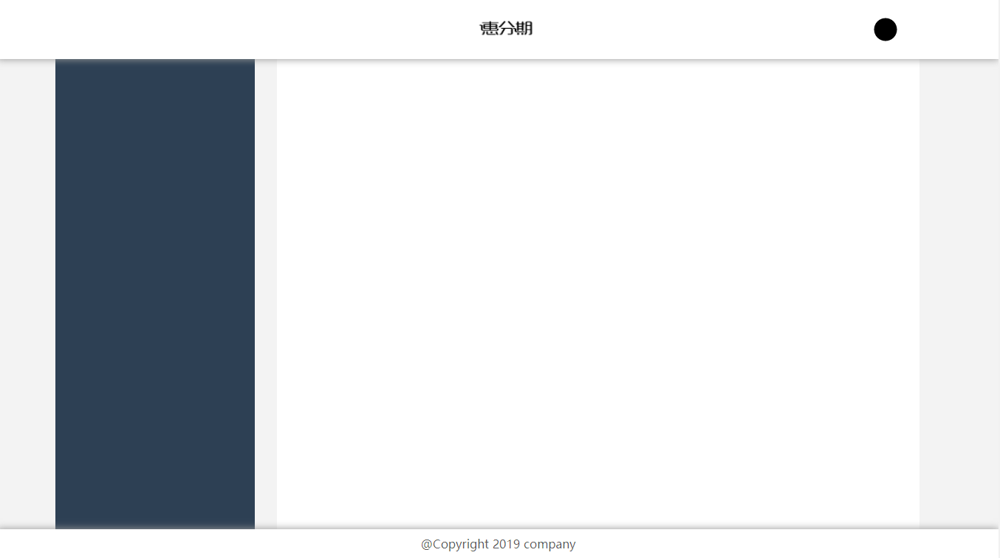
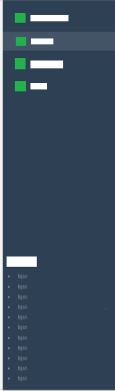
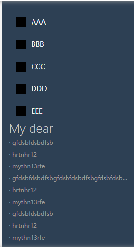
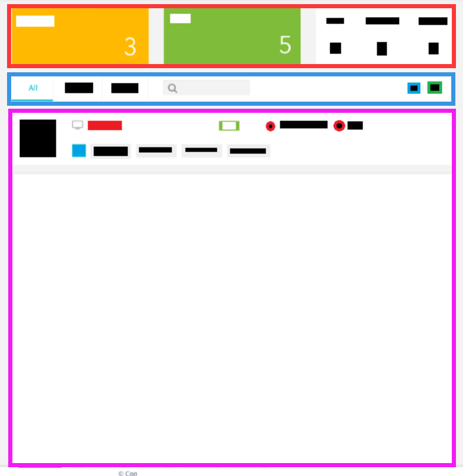
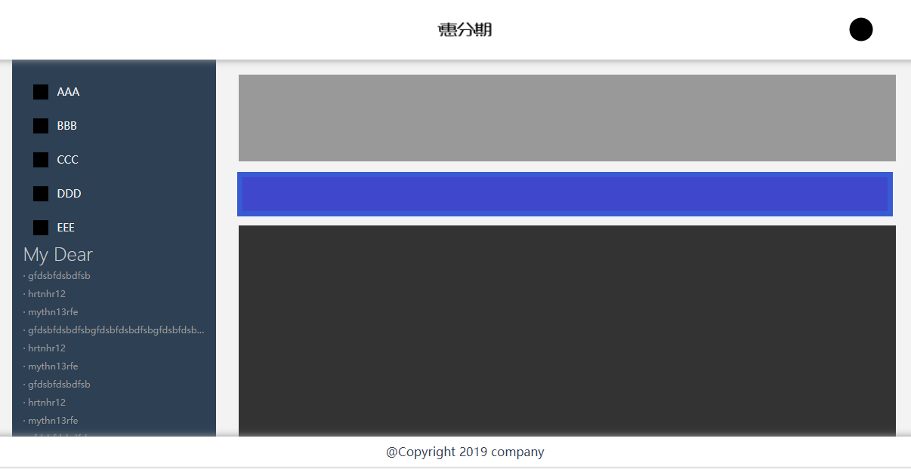
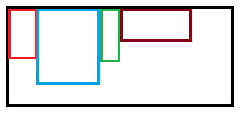

# tell-you-write-manage-page

教你如何写一个后端管理页面

# 手把手教你用套路写页面（HTML、CSS初中级前端教学）（第一节）

很多人不太会写 HTML 和 CSS，这里教你如何分析页面结构，如何使用各种标准套路写出各种页面。

以 HTML 和 CSS 为主，部分动态内容加入 js 实现。

所有套路全部简单暴力，没有兼容性问题（除非你要兼容IE8），但是非常好用。

* 源代码：https://github.com/qq20004604/tell-you-write-manage-page
* 作者微信：qq20004604
* 讨论（QQ群）：387017550

目录：

* 1、确定页面内容
* 2、环境准备
* 3、第一次页面区块划分思路
* 4、第一次の实现
* 套路1：上下固定中自适应布局
* 4.1、先搞定root样式文件
* 套路2：定高不定宽，内有居中和相对最右侧的元素
* 4.2、搞定header
* 套路3：文字居中，大小不定但高度固定
* 4.3、搞定footter
* 套路4：不定高，整体居中，左右分栏
* 4.4、搞定content
* 4.5、总结
* 5、左侧边栏（难度：3.5颗星）
* 5.1、原型分析
* 套路5：当高度/宽度为动态获取，且相邻联动的两个区域
* 5.2、左边栏上下区域划分
* 套路6：无痕滚动
* 5.3、按钮的 CSS
* 5.4、历史记录
* 5.5、总结

## 1、确定页面内容



## 2、环境准备

* 脚手架：webpack3；
* 前端框架：React；
* css预处理器：less、postcss；
* 其他：babel、eslint、file-loader、style-loader、css-loader、uglifyjs-webpack-plugin、url-loader；

采用我自己之前配好的脚手架，见github链接：https://github.com/qq20004604/react-with-webpack

可以直接fork该脚手架，然后在该脚手架基础上进行开发；

## 3、第一次页面区块划分思路

前注解释：

* div#box，表示 \<div id='box'>\</div>
* div.content-box，表示 \<div class='content-box'>\</div>

原图分为三块：

* header：Crulse和头像所在的那个部分；
* content：中间的左边栏和右边主要内容区域；
* footter：下方的copyright；

总体思路：

1. 上下部分固定，中间高度可变，宽度都为100%；
2. 中间区域固定宽度，左和右定宽不定高；

详细思路如下：

1. 整体被 div#app 所包含，撑满 100% 的页面区域，position设置为relative；
2. div#app 下包含 div#header，div#content，div#footter 三部分，三部分的position都设置为 absolute；
3. div#header 设置为 top：0，left：0，with：100%，height设置为实际高度；
4. div#footter 思路同样，bottom：0，left：0，with：100%，height设置为实际高度；
5. div#content的top和bottom设置为header和footter的height，left和right设置为0；

然后，div#content再划分为两块，具体思路如下：

1. div#content下包含 div.content-box，宽度设置为定宽。而 div#content 的 overflow-x 属性设置为auto，目的是当中间过窄时，出现滚动条；
2. div.content-box 下含 div.aside和div.article。具体需要注意的情况，等下一次页面模块划分时再进行分析；

## 4、第一次の实现

于 src/page 文件夹下新建 main 文件夹，并在该文件夹下新建 app.jsx。

此时 jsx 部分写法如下：

```
render() {
    return <div id={s.root}>
        <Header/>

        <Content/>

        <Footter/>
    </div>;
}
```

因此要引入（当然你也要新建）三个不同的jsx文件和根容器的样式文件，如下：

```
import s from './style.less';
import Header from './header.jsx';
import Content from './content.jsx';
import Footter from './footter.jsx';
```


### 套路1：上下固定中自适应布局

以这个页面为例，是标准的上下固定中自适应布局。

这种布局其实很简单。

第一，先引入reset.css统一样式，确保不同浏览器的样式是一致的。

第二，DOM结构如下，容器内包含上中下

```
<div id='app'>
    <Header/>

    <Content/>

    <Footter/>
</div>
```

第三，最外层DOM（``<div id='app'>``）的思路是，撑满整个可视区域作为基准容器，并设置绝对定位，为子容器提供定位参考。

这种写法的好处是，我们可以确定最外层DOM一定的撑满的，如果我们使用body标签作为最外层DOM，因为默认样式的不同，我们是不确定的。

样式如下：

```
#root {
  position: absolute;
  top: 0;
  left: 0;
  width: 100%;
  height: 100%;
}
```

第四，上和下这2个固定。

通过设置绝对定位的属性，使得上和下，分别位于基准容器的最上面和最下面。

样式如下：

```
#header {
  position: absolute;
  top: 0;
  left: 0;
  width: 100%;
  height: 80px;
}

#footter {
  position: absolute;
  bottom: 0;
  left: 0;
  width: 100%;
  height: 40px;
}
```

第五，中自适应。

自适应的前提是不需要设置高度，因此同样适用绝对定位，通过配置 top 和 bottom 属性，使得高度自适应。

样式如下：

```
#content {
  position: absolute;
  top: 80px;
  bottom: 40px;
  left: 0;
  width: 100%;
}
```

总结：

此时你有了一个上下固定中自适应布局并且宽度100%可视区域的布局了。并且他们都带有定位属性，你下面的布局可以基于这三块进行开发了。

### 4.1、先搞定root样式文件

核心有两步，其他都不太重要（也就是说，不重要的地方你就自己搞定咯）：

```
@import '~common/css/reset.css';

#root {
  position: absolute;
  top: 0;
  left: 0;
  width: 100%;
  height: 100%;
}
```

分别表示引入reset.css（这个我预置在脚手架里了，只要引入就行，全局生效）；

和设置根容器撑满整个可视区域。


### 套路2：定高不定宽，内有居中和相对最右侧的元素

这也是一个比较典型的布局。

以本页面为例：

* header部分里有居中和相对最右侧一定距离两个DOM；
* footter部分有居中元素；
* content区域也可以认为，左右两个分栏他们作为总体来看，也是居中的；

写法思路如下：

第一，父容器设置定位属性，不管是absolute或者是relative都可以；

第二，居中元素的思路是很简单。

以左右居中为例，通过 ``left:50%`` 的属性，使其相对于最左侧半个容器宽度的距离。然后再通过 ``transform: translateX(-50%);`` 往回拉自身元素宽度 ``50%`` 的距离。这样自然就实现左右居中。

如果上下居中，思路是一样的，无非是设置 ``top:50%`` 和 ``transform: translateY(-50%);``


第三，相对于最右侧一定距离的元素，这个思路也很简单。

* 该元素设置绝对定位：``position: absolute;``；
* 配置 ``right`` 属性，设置该元素最右侧距离父容器最右侧的距离；
* 设置该元素的宽高；
* 有必要的话，设置上下居中（参考上面第二条的方法）；

同样，如果是相对于左侧，顶部，底部，思路是同样的，只是换个css属性罢了。

### 4.2、搞定header

观察效果：

1. 中间文字居中；
2. 右侧头像和content区域内容最右边靠左一点；

参考上面的【套路2：定高不定宽，内有居中和相对最右侧的元素】，我们将整个结构变为：

1. 中间文字和右侧头像作为整体，放在一个DIV下，这个DIV相对于整个header居中；
2. 中间文字相对于他父DIV，居中；
3. 右侧头像，相对于父DIV，靠右设置位置；

整体思路如下：

1. div#header内部设一容器div.header-box，固定宽度（同div#content区域宽度）且居中，相对定位；
2. 居中的正常相对于div.header-box居中，右侧头像绝对定位并设置right的值来控制位置；
3. 由于头像应该是可配置的，并且有默认值，因此头像的路径放在根路径中，有默认值（一个默认图片的地址），并将该值传到 div#header，作为头像 img 标签的 src 属性；

具体代码见 src/page/main/header.jsx 相关

<b>图片路径写法：</b>

需要注意的是，js和css中，图片路径的写法是不同的。

具体来说，以我这个webpack的配置为例，

1、同样图片放在 src/img 文件夹下，css中的写法是：

```
background-image: url('~@/logo.png');
```

根据的配置是：

```
{
    loader: 'css-loader',
    options: {
        modules: false,
        minimize: true,
        sourceMap: false,
        alias: {
            '@': resolve('src/img'), // '~@/logo.png' 这种写法，会去找src/img/logo.png这个文件
            'common': resolve('src/common')
        }
    }
}
```

2、js中的写法是：

```
state = {
    // 注意，css和js中，图片路径写法不同
    avatarIcon: require('@/img/default-avatar.png')
}
```

根据的配置是：

```
resolve: {
    // 省略后缀名
    extensions: ['.js', '.jsx'],
    alias: {
        '@': resolve('src'),
        'component': resolve('src/components'),
        'common': resolve('src/common'),
        'api': resolve('src/api'),
        'page': resolve('src/page'),
        'assets': resolve('src/assets')
    }
} 
```

当然，也可以写成：``avatarIcon: require('../../img/default-avatar.png')``

3、如果图片会上传到CDN，有固定路径，那就更好写了，直接写成绝对路径即可；

4、图片放在static文件夹下，css可以直接写为：``background-image: url('/default-avatar.png')``

js的话可以写为：

```
state = {
    avatarIcon: 'static/default-avatar.png'
}
```

### 套路3：文字居中，大小不定但高度固定

文字居中是一个很常见的需求，但情况又比较多。因此我们采用固定套路来实现。

要求描述：

* 父容器 footer，不定高不定宽；
* 文字的 ``font-size`` 已知，但里面文字内容数量不定（也就是说宽度不固定），但要求上下居中，左右居中；

考虑到要求，因此将文字包含在一个div中，整体考虑，于是HTML代码如下：

```
<div id='footter'>
    <div className='footter-copyright'>
        @Copyright 2019 company
    </div>
</div>
```

思路：

1. 将所有文字视为一个整体，不设 div 宽度，让文字大小自然撑起来 div 的宽度和高度；
2. 通过套路2，让该文字所在div上下左右居中；
3. 需求完成；

css如下：

```
.footter-copyright {
    position: absolute;
    left: 50%;
    top: 50%;
    transform: translate(-50%, -50%);
    /* 下面三个属性的px值保持一致
     * 另外，除了第三个，其他2个可以省略，但我习惯明确写其高度和行高
     * 好处是，如果有特殊需求，调起来很方便。
     */
    height: 16px;
    line-height: 16px;
    font-size: 16px;
}
```

另一种写法（已知高度固定）：

```
  .footter-copyright2 {
    position: absolute;
    left: 50%;
    top: 0;
    transform: translateX(-50%);
    height: 40px;
    line-height: 40px;
    font-size: 16px;
  }
```


### 4.3、搞定footter

footter 明显就更简单了，只有一段居中文字而已。参考【套路3：文字居中，大小不定但高度固定】实现他。

### 套路4：不定高，整体居中，左右分栏

这也是一个典型的情况。

* 整体居中，宽度固定（可以观察，包括淘宝在内绝大多数页面，中间区域都是定宽的）；
* 居中部分左右分栏，且宽度固定；
* 这里额外情况是，左右分栏之间有距离，但其实没什么影响；
* 左中右三层分栏和左右两层分栏的写法是没有区别的；

思路如下：

* 不考虑极端情况的显示效果（比如用户让浏览器可视区域高度特别小）；
* 三层DIV：
* 祖父容器提供定位属性；
* 父容器定宽，左右居中，且高度撑满祖父容器；
* 左右分栏在该父容器下，且高度撑满，位置分别相对于父容器的左右，宽度定宽配置；

特殊情况：

* 例如整体是撑满整个页面的（即不定宽）；
* 此时一般是左侧定宽，右侧不定宽；
* 左侧写法同上面；
* 右侧写法其实没啥变化，无非是通过 right 和 width 定位，变为通过 left 和 right 定位；
* 此时右侧内部应写成可响应模式，然后使用浮动布局（即 float）；


### 4.4、搞定content

参考上面的 【套路4：不定高，整体居中，左右分栏】

需要注意的是，这个中间整体看似只有1170px宽，实际应该是1200px宽，右侧分栏的左右分别有 30px 宽度的空隙（这种需要经验和交互进行沟通，或者自己量一下）。

因此右侧分栏实际应该多写一层div，即实际内容区域应在右侧分栏div区域内。

代码如下（更详细代码参考我的github，链接见【4.5】）：

```
@aside-bk-color: #2d4054;

#content {
  position: absolute;
  top: 80px;
  bottom: 40px;
  left: 0;
  width: 100%;
  background-color: #f3f3f3;

  .content {
    position: absolute;
    left: 50%;
    transform: translateX(-50%);
    width: 1200px;
    height: 100%;

    .aside {
      position: absolute;
      left: 0;
      width: 270px;
      height: 100%;
      background-color: @aside-bk-color;
    }

    .article-box {
      position: absolute;
      left: 270px;
      right: 0;
      height: 100%;
      padding: 0 30px;

      .article {
        position: relative;
        width: 100%;
        height: 100%;
        // 带上颜色，用于确定该位置是正确的
        background-color: #fff;
      }
    }
  }
}
```

### 4.5、总结

此时，页面效果图如下：



此时代码参考分支：

https://github.com/qq20004604/tell-you-write-manage-page/tree/0.0.1-%E6%95%B4%E4%BD%93%E5%B8%83%E5%B1%80done


## 5、左侧边栏（难度：3.5颗星）

前文参照：

手把手教你用套路写页面（HTML、CSS初中级前端教学）（第一节）：https://juejin.im/post/5d4a6f2c5188255b3e412801

### 5.1、原型分析

我们先看原型图：



分析：

* 整体结构为上下两部分；
* 上方由不定数量的单行按钮组成，从上到下延伸（因此需要考虑如果数量比较多，超出显示区域怎么办）；
* 下方由不定数量个历史操作组成；

总体考虑，我认为，这个布局有两种方法。

第一种（简单版）：

* 上下期中一个高度是固定的，另一个自适应（通常来说，下最大高度不高，所以下应是固定的，上自适应）；
* 自适应部分 ``overflow-y: auto``；

第二种（困难版）：

* 上不定高；
* 下不定高但有最大高度限制；
* 上的最大高度根据下的最大高度变化；
* 上超出最大高度时，出现滚动条（或可以拖动滑动）；
* 下超出最大高度时，只显示最新的；

我们采用第二种方式进行开发（第一种太简单）。

第二种情况，纯css通常是无法解决的，因此我们需要js介入。

注：虽说flex可以，flex在某些老版本浏览器（非IE678）或者手机浏览器，比如IOS10以前，是可能出现bug的。我之前在阿里时，接到过来自客户反馈。因此不采用flex。

下方历史记录的代码思路：

1. 历史记录整体为绝对定位，``bottom: 0; width: 100%``；
2. 设置下方的最大高度，最大高度为 ``h_max = dear的高度 + 单行历史记录的高度 * 最大显示历史记录的个数``；
3. 下方理论高度为 ``h_count = dear的高度 + 单行历史记录的高度 * 历史数目个数``；
4. 实际高度为 ``h = h_count > h_max ? h_max : h_count`` ；
5. 下方默认有一条，当实际没有的时候，显示为【无】（占位使用）；

上方按钮的代码思路：

1. 绝对定位，``top: 0``；
2. 拿到下方的实际高度 h， 设置自己的 bottom 的值为 h；
3. 设置 ``overflow-y: auto``；

### 套路5：当高度/宽度为动态获取，且相邻联动的两个区域

这是一个常见场景，通常见于其中一个区域数据来自于后端，另外一个区域填充以配合前者。

场景：

* 父容器不定宽不定高（但确定可以容纳两个子元素）；
* 两个子元素共同填满父容器，且左右/上下相邻（为了方便分析，这里假设其上下相邻）；
* 【假设上下相邻】；
* 两个子元素都不定高，但其中一个有最大高度（主次之分）；
* 有最大高度的子元素，其高度是动态获取的；

解决思路：

方法一（简单，但在极少数情况下会出现兼容性问题）：

* 假设两个子元素上下相邻，高度弹性；
* 采用弹性布局： flex；
* 配置子元素的弹性方向： flex-direction；
* 两个子元素都不设置高度，但宽度为100%；
* 设置有最大高度限制的子元素，其最大高度：max-height；
* 设置无最大高度限制的子元素（即另一个子元素），获得全部的剩余弹性空间分配： flex-grow；
* 于是受高度限制的子元素，其高度被填充内容的高度撑开；
* 而剩下的区域，被另外一个子元素拿走；

方法二（复杂，可靠，可配置性强）：

* 假设两个子元素上下相邻，高度弹性；
* 父容器不定宽高，因此子容器需要写为绝对定位，位置通过 left, top, bottom, right 来实现；
* 两个子元素设置宽度为100%；
* 受限制一方的高度，通过js计算得出，然后写在标签的 style 属性的 height 值；
* 另一方的高度，其不设置 height 的值，而是通过设置 bottom 的值等于 style 属性的 height 值；
* 此时，两个元素的位置和高度，都已经被设置完毕了；

### 5.2、左边栏上下区域划分

参考【套路5、当高度/宽度为动态获取，且相邻联动的两个区域】的方法二的思想。

HTML代码很简单，整体来看是两层DOM结构，代码如下：

```
<div className="aside">
    <div className='aside-nav'
         style={navStyle}>

    </div>

    <div className='aside-my-dear'
         style={my-dearStyle}>

    </div>
</div>
```

上下两部分的样式也很简单，标准的位置固定但高度不固定（注意，下面代码，我没有写两个子元素的高度）

```
.aside-nav {
  position: absolute;
  top: 0;
  left: 0;
  width: 100%;
  // 测试用，查看显示效果是否正常
  //background-color: red;
}

.aside-dear {
  position: absolute;
  bottom: 0;
  left: 0;
  width: 100%;
  // 测试用，查看显示效果是否正常
  //background-color: green;
}
```

现在，核心问题在于如何配置其高度，方法如下（见注释和上面的分析）：

```
// 历史记录的数量，最小为1（为0时，该位置为占位符）
let dearLength = asideData.asideDear.length < 1 ? 1 : asideData.asideDear.length
        
// 最大只允许显示【10】行
const MAXDEARCOUNT = 10;
if (dearLength > MAXDEARCOUNT) {
    dearLength = MAXDEARCOUNT
}

// 历史记录的高度 =  dear的高度34px（24px字体+5*2px上下部分行间距）
//                  + 历史记录单行高度22px（12px字体高度+5*2上下行间距）
//                  + 最下方留白5px
const dearHeight = 34 + 22 * dearLength + 5;
const navStyle = {
    bottom: `${dearHeight}px`
}
const dearStyle = {
    height: `${dearHeight}px`
}
```

此时我们已经配置好了两个子元素的高度，并且是动态生成的。

于是，给出 asideData.asideDear 的模拟数据：

```
asideDear: [
    {
        // 跳转url
        url: '#01',
        // 历史文字显示
        text: 'gfdsbfdsbdfsb'
    },
    {
        url: '#02',
        text: 'hrtnhr12'
    },
    {
        url: '#03',
        text: 'mythn13rfe'
    }
]
```

此时，我们更改 asideDear 的元素个数，会发现 dear 区域的高度发生变化。

【缺点】

该方案是没问题的，硬要说缺点的话，就是上方区域按钮比较多的时候，默认出现滚动条比较丑。

解决方案也不难，提供几个参考：

1. 考虑手写一个滚动条，样式和整体风格保持一致；
2. 不显示滚动条，但提供拖拽功能（即类似触摸屏的操作方式），然后给是否达到最上、最小的提示；
3. 隐藏滚动条，但依然可以使用滚动功能（即按钮和上分栏之间插入一层父级div，该级div比显示区域更宽，滚动条即位于这更宽的区域之内，但受到其父级div overflow:hidden的约束，无法显示）；

我这里采用第三种解决方案，方法参考【套路6：无痕滚动】

### 套路6：无痕滚动

场景描述：

* 假如父容器只有 100px 高，每个元素高 30px，可能有超过 3 个元素，但不允许超出父容器范围；
* 因此一般情况下，设置父容器 overflow:auto； 显示滚动条；
* 默认滚动条太难看，但不需要写自定义滚动条；
* 因此需要支持鼠标滚动，但不显示鼠标滚动；

解决思路：

1. 父容器和子元素之间加一层 div#box；
2. 假设父容器和子元素的宽度为 100px， 默认滚动条宽度为 25px；
3. div#box 的高度设为 100%（同父容器），宽度设为 125px（100+25）。假如元素过多，则 div#box 出现滚动条；
4. 父容器设置 overflow:hidden，那么 div#box 出现滚动条的时候，将在父容器显示范围之外；
5. 子元素设置 max-width:100px，确保无论是否有滚动条，子元素的显示效果都是一致的。


### 5.3、按钮的 CSS

这个太简单了，无非就是按钮里面一图标一文字，就只说一下思路吧。

1. 按钮的大小是固定的（不固定也无所谓，肯定有参考位置），添加定位属性，比如相对定位 relative；
2. 图标设置为绝对定位，上下居中（参考【套路2：定高不定宽，内有居中和相对最右侧的元素】），然后再设置相对左侧距离（left属性）；
3. 文字同样绝对定位，上下居中，通过 left 相对左侧的距离。唯一区别是，需要通过 right 属性设置最右侧的宽度，防止文字超出其应该显示的区域；

需要注意的是：

* 这个样式按钮hover状态是 45px 高，因此认为一个按钮的高度为45px；
* 但通过PS量实际两个按钮实际间距是50px（醉了！+1），无视，认为是原型图的问题，认为按钮与按钮的实际间距是45px（即按钮是连续的，不存在额外的间距）；
* 但又发现第一个按钮的高度是65px（醉了+2，这种设计很奇怪）；
* 推定按钮的父容器有额外 ``padding-top: 20px;``；

代码参照：

```
src/components/aside/index.jsx
src/components/aside/style.less
```

### 5.4、历史记录

解决了高度问题后，这个就更简单了。

* Dear 文字所在 div 宽度 100%，
* 每个历史记录 div 宽度 100%，高度、行高等于实际高度；
* 父级 div 设置 padding-bottom 下方留出应有的空隙；

完事。 


### 5.5、总结

此时效果图如下：（假设按钮比较多的极端情况效果图）



此时代码参考分支：

https://github.com/qq20004604/tell-you-write-manage-page/tree/0.0.2-%E5%B7%A6%E8%BE%B9%E6%A0%8Fdone

## 6、右边栏（难度：3颗星，繁琐度：4颗星）

### 6.1、原型图分析和第二次区块划分

在写HTML的时候，一定要有以下几个思维习惯：

1. 相邻相关相似区块，划分为一个整体——即放在同一个 DIV 下；
2. 不相关区块，应属于不同的整体；

如下图



于是，根据以上思路，区块划分如下：

* 红色区域：三个区块他们具有共同的特点（相邻，高度一致，宽度相同或相似，并排），因此划分为一个整体；
* 蓝色区域：是一个完整的 Tab 栏，因此划分为一个整体；
* 紫色区域：是一个列表，列表内部的元素是同一类型的，因此划分为一个整体；

整体HTML结构如下（类名为示例）：

```
<div className="article">
    {/* 红色区域 */}
    <div className="global-state">
        <div className="MY-ABC"></div>
        <div className="MY-DEF"></div>
        <div className="statistics"></div>
    </div>
    {/* 蓝色区域 */}
    <div className="article-tabs"></div>
    {/* 紫色区域 */}
    <div className="site-list">
        <div className="site"></div>
        <div className="site"></div>
    </div>
</div>
```

由于 div.article 是定宽不定高。而红色区域和蓝色区域，高度显然是固定的，因此，紫色区域使其高度自适应。

写法还是老规矩：

* 父容器 div.article 添加定位属性；
* div.global-state与div.article-tabs 通过 top 和 height 定位；
* div.site-list 通过 top 和 bottom 来定位；

效果图如下：




### 套路7：多个元素排排站

有这样一个常见场景：



* 黑色区域为父容器；
* 红、蓝、绿、咖啡色为四个子元素；
* 子元素之间需要紧紧靠着（当然，如果有间距，也就加个margin-right，基本没影响）；
* 然后他们都是靠着父容器的最上方；

思路：

* 假如子元素宽度固定，我们可以让父容器带定位属性，然后子元素通过设置 left 和 top 定位，确保他们一定能靠着最上方；
* 假如子元素不固定，那么第一种方法就不行了（或者说很麻烦），但也是可以实现的，CSS代码如下：

```
display: inline-block;
float: left;
vertical-align: top;
```

原理是让其变为行级元素，再通过控制行级元素的位置来实现靠最上方（靠下方道理是一样的）。而 float:left 使其从左往右排排站。

### 6.2、红色区域

红色区域三个区块但只有2个区块类型。

* 左和中区块：宽高一致，结构一致。背景图 + 左上固定位置文字 + 右下固定位置但不固定宽度数字；
* 右区块：宽高和左中区块一致。内部三等分三栏，除了文字不一样，其他都是一样的。

因此，三个区块有共同样式：

```
.base-box {
  position: absolute;
  top: 0;
  height: 100%;
  width: 270px;
  overflow: hidden;
}
```

唯一区别是，三个区块的 left 值不同，left 负责 x 轴位置定位。

左和中区块写法很简单，背景图片居中，然后两个文字分别 left 和 right 定位，然后不写宽度让其自由撑开 width。除非特殊情况会导致数字超出范围，默认情况下是没问题的。

右边的也不难。由于单个区块270px，因此继续拆分为左中右三部分，每部分 90px 宽。然后这样写他们的样式：

```
.statistics-item {
    position: relative;
    display: inline-block;
    float: left;
    vertical-align: top;
    width: 90px;
    height: 100%;
}
```

其中，``display``, ``float``, ``vertical-align``是为了确保他们三个可以稳稳当当的排排站。参考【套路7：多个元素排排站】

当然，另一种简单写法是，直接用绝对定位限制他们的位置和宽高也可以（就像之前那样做的）。


